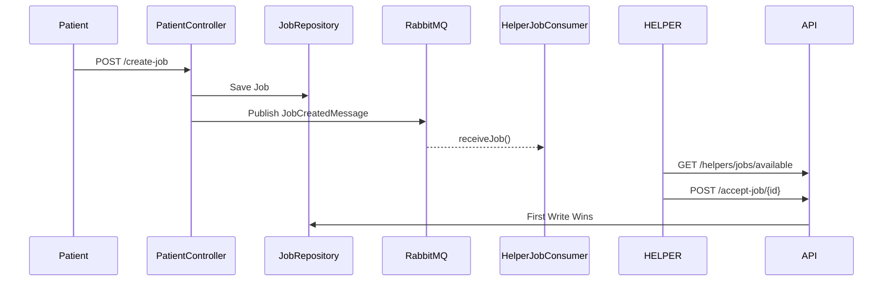

🚀 CareNest Helper Service

Spring Boot + RabbitMQ + PostgreSQL | Event-Driven Job Assignment Demo

CareNest Helper Service is a production-ready microservice skeleton that demonstrates:

✔ Clean multi-layer architecture
✔ REST API design for Helpers & Patients
✔ RabbitMQ event broadcasting
✔ First-helper-wins job assignment logic
✔ PostgreSQL persistence
✔ Docker-ready deployment

This repository is designed to be both an educational reference and a base platform for real applications such as:

🩺 Home-care services
🛵 On-demand workforce apps
🚖 Uber-like assignment systems
🧹 Urban Company-style helper dispatching

🎯 What This Project Demonstrates
Feature	Implemented?
Helper registration	✅
Patient registration	✅
Patient creates job	✅
Job stored in DB	✅
Job broadcast via RabbitMQ	✅
Helpers receive broadcast	✅
Helpers fetch available jobs	✅
Helpers compete via /accept-job	✅
First helper wins	✅
REST + Event driven hybrid	✅
🏗 Technology Stack
Layer	Technology
Backend Framework	Spring Boot 3.x
Language	Java 17
Messaging	RabbitMQ (fanout exchange)
Database	PostgreSQL
Build Tool	Gradle
Dependencies	Spring Web, Spring Data JPA
Validation	Jakarta Validation
Execution	Docker-ready
📂 Project Structure
src/main/java
└── com.carenest
    ├── app
    │   └── CareNestApplication.java        <-- Main entrypoint
    │   └── config
    │          ├── RabbitMQConfig.java     <-- Queue + Exchange + Message converter
    │          └── SecurityConfig.java     <-- Disables security for demo
    │
    ├── helper
    │   ├── controller/HelperController.java
    │   ├── service/HelperRegistrationService.java
    │   ├── service/impl/HelperRegistrationServiceImpl.java
    │   ├── repository/HelperRepository.java
    │   ├── consumer/HelperJobConsumer.java
    │   ├── entity/Helper.java
    │   ├── entity/Job.java
    │   └── dto (JobCreatedMessage, RegisterRequest, CreateJobRequest)
    │
    └── patient
        ├── controller/PatientController.java
        ├── service/PatientRegistrationService.java
        ├── service/impl/PatientRegistrationServiceImpl.java
        ├── entity/Patient.java
        └── repository/PatientRepository.java

🧠 SYSTEM BEHAVIOR – END-TO-END
PATIENT → creates a job
           ↓
Job stored in PostgreSQL
           ↓
Job broadcast via RabbitMQ Fanout Exchange
           ↓
All helpers are notified immediately
           ↓
Helper calls GET /helpers/jobs/available
           ↓
Helper selects a job → POST /accept-job/{id}
           ↓
FIRST HELPER WINS (atomic DB write)

🔧 Core Components Explained
⚙ CareNestApplication.java

Bootstraps:

✔ RabbitMQ
✔ JPA
✔ All packages under com.carenest

⚙ RabbitMQConfig

Defines:

Component	Value
Exchange	jobs.broadcast.exchange (Fanout)
Queue	helper.jobs.queue
Converter	JSON (Jackson2)

Every job created → broadcast to all helpers via fanout

⚙ HelperJobConsumer
@RabbitListener(queues = HELPER_JOBS_QUEUE)
public void receiveJob(JobCreatedMessage msg)

➡ Fires automatically whenever patient creates job
➡ Prints job details (simulating mobile app notification)

⚙ Helper APIs
🔹 Register Helper

POST /api/helpers/register

🔹 View All Helpers

GET /api/helpers/all

🔹 Get Available Jobs

GET /api/helpers/jobs/available

Returns only jobs where:

accepted = false

🔹 ACCEPT A JOB

POST /api/helpers/accept-job/{jobId}?helperPhone=9991112222

✔ FIRST helper wins
✔ Others get "Job already taken"

⚙ Patient APIs
🔹 Register Patient

POST /api/patients/register

🔹 Create Job

POST /api/patients/create-job

Example:

{
  "patientPhoneNumber": "+919876543210",
  "location": "Noida"
}

➡ Saves job → Publishes message → Helpers receive

🗄 Database Entities
Table	Purpose
helpers	Registered helpers
patients	Registered patients
jobs	Job requests posted by patients
Job Table Example
field	value
id	UUID
patientPhoneNumber	+91888..
location	Noida
accepted	false / true
acceptedByHelper	null / "999119922"
📡 SEQUENCE DIAGRAM

🐳 Run with Docker
Build
./gradlew bootJar
docker build -t carenest-helper-service .

Run Backend
docker run -p 8080:8080 carenest-helper-service

Run PostgreSQL
docker run --name carenest-helper-db \
 -e POSTGRES_PASSWORD=postgres \
 -e POSTGRES_DB=carenest-helper \
 -p 5432:5432 -d postgres

🧪 Test Endpoints (Postman)
Register Helper
POST /api/helpers/register

{
 "name": "Nitin",
 "phoneNumber": "+919888000111",
 "address": "Delhi",
 "dob": "1995-01-01"
}

Create Job
POST /api/patients/create-job

Accept Job
POST /api/helpers/accept-job/{jobId}?helperPhone=XXXXX